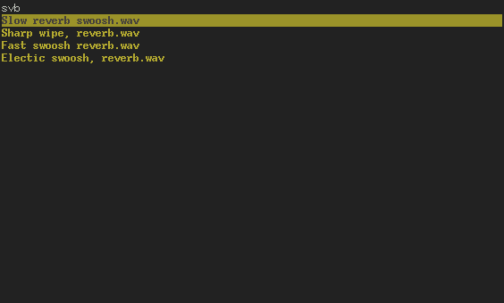

mandrake
========

Incrementally and fuzzily search and play sound effects in the terminal.  
Mandrake requires pygame for playing sounds, and thus may fail to play mp3s depending on platform.

Typing searches, ESC clears current search, arrow keys select, enter plays.  
Typing ":q" and pressing enter will quit.

A (silent) demonstration can be seen here: http://asciinema.org/a/6940

Code is released into the public domain via CC0.
